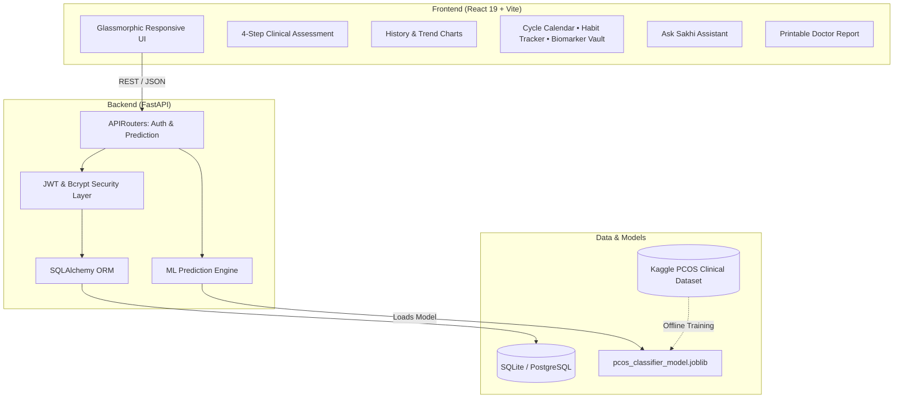

# 🌸 SakhiCare — AI-Powered PCOS Risk Screening & Women's Health Platform

<div align="center">

[](https://fastapi.tiangolo.com)
[](https://reactjs.org)
[](https://vitejs.dev)
[](https://scikit-learn.org)
[](https://python.org)
[](LICENSE)

**An intelligent, non-invasive Polycystic Ovary Syndrome (PCOS) risk screening engine, clinical companion, and holistic hormonal health management suite.**

[Explore Features](#-features) • [Architecture](#-architecture) • [Getting Started](#-getting-started) • [API Documentation](#-api-endpoints) • [Clinical Evidence](#-clinical-markers--machine-learning)

</div>

---

## 📖 Overview

**SakhiCare** (*Sakhi* = Trusted Female Friend / Companion) bridges the gap between early symptom awareness and clinical diagnosis for Polycystic Ovary Syndrome (PCOS). PCOS impacts an estimated **1 in 5 women** worldwide, yet up to **70% of affected women remain undiagnosed** due to fragmented symptoms, social stigma, and complex diagnostic barriers.

By evaluating **13 non-invasive phenotypic, menstrual, and lifestyle markers**, SakhiCare delivers instant, clinically-backed risk stratification powered by a trained **Random Forest Classifier (86%+ Accuracy)**. Beyond prediction, SakhiCare equips users with a comprehensive hormonal health toolkit: interactive cycle phase tracking, daily holistic habit logs, nutrition guidance, biomarker vaults, and printable medical summaries for doctor consultations.

---

## ✨ Features

### 🩺 1. 4-Step Clinical Assessment Wizard
* **Step 1: Biometrics** — Age, height, weight with instantaneous automated BMI calculation and health category feedback.
* **Step 2: Menstrual Cycle** — Cycle regularity (Regular vs. Irregular) and cycle length (days) to detect oligo/anovulation.
* **Step 3: Clinical Phenotypes** — High-impact androgenic and metabolic markers:
  * Hirsutism (excess facial and body hair)
  * Acanthosis Nigricans (darkening of skin folds/neck)
  * Persistent acne / breakouts
  * Scalp hair thinning / androgenic alopecia
  * Unexplained or rapid weight gain
* **Step 4: Lifestyle Determinants** — Fast food consumption patterns and physical exercise frequency.

### 📊 2. Explainable AI Risk Stratification
* **Radial Risk Meter** — Calibrated 0–100% probability gauge with dynamic animations.
* **Risk Categorization**:
  * 🟢 **Low Risk (< 35%)**: Hormonal balance maintenance guidance.
  * 🟡 **Moderate Risk (35% – 59%)**: Preventative lifestyle interventions and active cycle monitoring.
  * 🔴 **High Risk (≥ 60%)**: Immediate clinical consultation advice, recommended lab tests, and ultrasound referrals.
* **Driver Attribution** — Breakdown of personal risk drivers explaining *why* the score was assigned.
* **Actionable Next Steps** — Personalized dietary, lifestyle, and medical guidelines.

### 🗓️ 3. Menstrual Cycle & Hormone Phase Suite
* **Cycle Calendar** — Interactive visual calendar tracking menstruation, fertile windows, and projected ovulation dates.
* **Hormone Phase Engine** — Real-time tracking of the 4 hormonal phases (*Menstrual, Follicular, Ovulatory, Luteal*) with personalized advice for energy levels, exercise intensity, and metabolic needs.

### 🥗 4. Anti-Inflammatory Nutrition & Lifestyle Guide
* Evidence-based dietary recommendations targeting **insulin sensitivity** and **androgen reduction**.
* Curated food categories: low-GI swaps, anti-inflammatory superfoods, seed cycling combinations, and gut-healthy fiber choices.
* Explicit flags for endocrine-disrupting and inflammatory ingredients.

### 🧪 5. Biomarker Vault & Lab Tracker
* Longitudinal storage for clinical diagnostic labs:
  * **LH : FSH Ratio** (Luteinizing Hormone to Follicle-Stimulating Hormone)
  * **Fasting Insulin & HOMA-IR** (Homeostatic Model Assessment for Insulin Resistance)
  * **AMH** (Anti-Müllerian Hormone — ovarian reserve and follicle count)
  * **Free / Total Testosterone**
  * **Fasting Blood Glucose**
* Normal reference ranges and clinical context for each biomarker.

### 🌿 6. Daily Habit & Routine Tracker
* Targeted daily routines supporting hormonal homeostasis:
  * Inositol / Omega-3 supplementation
  * Spearmint tea (natural anti-androgen)
  * Seed cycling (Pumpkin/Flax in Follicular, Sunflower/Sesame in Luteal)
  * Daily 30-minute physical activity & hydration monitoring

### 💬 7. "Ask Sakhi" AI Health Companion
* Conversational AI assistant trained to answer PCOS-related questions, explain medical terminology, debunk myths, and provide holistic symptom relief guidance.

### 📈 8. Longitudinal History & Doctor Reports
* **Assessment History Dashboard** — Historical logs with comparison modals to inspect changes across screenings.
* **Trend Analytics** — Visual charts showing risk score trajectory, BMI changes, and symptom progression over time.
* **Printable Clinical Summary** — One-click printable medical summary formatted specifically for gynecologists and endocrinologists to streamline in-person consultations.

---

## 🏗️ Architecture



---

## 🧠 Clinical Markers & Machine Learning

### Dataset & Training
The model is trained on a comprehensive clinical dataset containing non-invasive patient records, biometric measurements, and confirmed PCOS diagnoses (Rotterdam criteria).

* **Algorithm**: `RandomForestClassifier` (100 estimators, stratified cross-validation)
* **Optimization**: Hyperparameter tuning prioritizing recall and specificity to minimize false negatives in clinical screening.
* **Input Dimensions**: 13 non-invasive clinical & lifestyle features.

### Feature Specification

| Feature Name | Clinical Rationale | Type / Range |
| :--- | :--- | :--- |
| **Age** | Peak incidence occurs in reproductive years (18–35) | Continuous (years) |
| **Weight & Height** | Used to calculate Body Mass Index (BMI) | kg, cm |
| **BMI** | Strong correlation with insulin resistance and adiposity | Continuous ($\text{kg/m}^2$) |
| **Cycle Regularity** | Hallmark of oligo-anovulation / ovarian dysfunction | Binary (Regular / Irregular) |
| **Cycle Length** | Cycles > 35 days indicate anovulatory cycles | Continuous (days) |
| **Weight Gain** | Manifestation of impaired glucose metabolism & insulin surge | Binary (Yes / No) |
| **Hirsutism** | Excess terminal hair in androgen-sensitive zones | Binary (Yes / No) |
| **Acanthosis Nigricans** | Cutaneous sign of severe systemic insulin resistance | Binary (Yes / No) |
| **Hair Thinning** | Androgenic alopecia triggered by elevated DHT | Binary (Yes / No) |
| **Persistent Acne** | Sebum overproduction driven by excess androgens | Binary (Yes / No) |
| **Fast Food Frequency** | Dietary driver of systemic inflammation and insulin spikes | Binary (Yes / No) |
| **Regular Exercise** | Improves GLUT-4 translocation and insulin sensitivity | Binary (Yes / No) |

---

## 💻 Tech Stack

### Frontend
* **Core**: [React 19](https://react.dev/), [Vite](https://vitejs.dev/)
* **Styling**: Custom Modern Vanilla CSS Design System (Soft blush, deep slate, medical teal, glassmorphism, responsive flex/grid)
* **Icons & UI FX**: [Lucide React](https://lucide.dev/), [Canvas Confetti](https://www.npmjs.com/package/canvas-confetti)
* **Code Quality**: [Oxlint](https://oxc-project.github.io/)

### Backend & Machine Learning
* **Web Framework**: [FastAPI](https://fastapi.tiangolo.com/) (Asynchronous, OpenAPI 3.0 / Swagger UI)
* **Machine Learning**: [Scikit-Learn](https://scikit-learn.org/), [Pandas](https://pandas.pydata.org/), [Joblib](https://joblib.readthedocs.io/)
* **ORM & Database**: [SQLAlchemy](https://www.sqlalchemy.org/) (SQLite for local dev, PostgreSQL production-ready)
* **Authentication**: JWT tokens via `python-jose`, secure password hashing with `passlib` / `bcrypt`
* **Validation**: [Pydantic v2](https://docs.pydantic.dev/)

---

## 📂 Project Structure

```plaintext
Sakhicare/
├── api/                           # Standalone / containerized API endpoints
├── app/                           # Core FastAPI application
│   ├── auth.py                    # JWT token creation, verification, password hashing
│   ├── config.py                  # Environment settings & secrets
│   ├── database.py                # SQLAlchemy engine & session maker
│   ├── main.py                    # FastAPI root application & middleware
│   ├── models.py                  # Database ORM tables (User, RiskAssessment)
│   ├── schemas.py                 # Pydantic validation schemas
│   └── routers/
│       ├── auth_router.py         # /auth/signup & /auth/login routes
│       └── predict_router.py      # /api/predict & /api/assessments routes
├── data/                          # Clinical datasets (Excel / CSV)
├── frontend/                      # React 19 + Vite frontend
│   ├── src/
│   │   ├── components/            # Reusable UI widgets & feature modals
│   │   │   ├── AskSakhiWidget.jsx          # Conversational AI assistant
│   │   │   ├── AssessmentComparisonModal.jsx# Assessment comparison modal
│   │   │   ├── AssessmentDetailModal.jsx   # Detailed report viewer
│   │   │   ├── AssessmentWizard.jsx        # 4-step clinical questionnaire
│   │   │   ├── AuthModal.jsx               # Login & Registration modal
│   │   │   ├── BiomarkerVaultWidget.jsx    # Lab metrics logger
│   │   │   ├── CycleCalendarWidget.jsx     # Menstrual health & phase tracker
│   │   │   ├── DashboardCharts.jsx         # Longitudinal risk & BMI charts
│   │   │   ├── HabitTrackerWidget.jsx      # Daily hormonal routine tracker
│   │   │   ├── Hero.jsx                    # Landing page hero section
│   │   │   ├── HistoryDashboard.jsx        # Historical assessments table
│   │   │   ├── HormonePhaseWidget.jsx      # 4-phase hormone guidance
│   │   │   ├── LearnPCOS.jsx               # Clinical education center
│   │   │   ├── Navbar.jsx                  # Top navigation & user controls
│   │   │   ├── NutritionGuideWidget.jsx    # Anti-inflammatory meal guide
│   │   │   ├── PrintableDoctorReport.jsx   # Exportable clinical brief
│   │   │   ├── ResultCard.jsx              # Radial gauge & prediction results
│   │   │   └── Sidebar.jsx                 # Collapsible navigation drawer
│   │   ├── services/              # API communication layer
│   │   ├── App.jsx                # App layout, state & tab management
│   │   ├── index.css              # Custom design system & design tokens
│   │   └── main.jsx               # React DOM entry point
│   ├── package.json
│   └── vite.config.js
├── models/                        # Serialized ML model artifacts (.joblib)
├── training/                      # ML model training & evaluation scripts
│   └── train_model.py             # Data preprocessing, training, and export
├── Dockerfile                     # Containerization specification
├── requirements.txt               # Backend Python dependencies
└── README.md                      # Project documentation
```

---

## 🚀 Getting Started

### Prerequisites
* **Python 3.10+**
* **Node.js 18+** and **npm**
* **Git**

---

### 1. Clone the Repository
```bash
git clone https://github.com/nishasss692/Sakhicare.git
cd Sakhicare
```

---

### 2. Backend Setup (FastAPI)

1. **Create and activate a virtual environment**:
   ```bash
   # Windows (PowerShell)
   python -m venv venv
   .\venv\Scripts\Activate.ps1

   # macOS / Linux
   python3 -m venv venv
   source venv/bin/activate
   ```

2. **Install Python dependencies**:
   ```bash
   pip install -r requirements.txt
   ```

3. **(Optional) Train or retrain the Machine Learning Model**:
   ```bash
   python training/train_model.py
   ```
   *The trained model will be generated and saved directly to `models/pcos_classifier_model.joblib`.*

4. **Run the FastAPI server**:
   ```bash
   uvicorn app.main:app --reload --host 127.0.0.1 --port 8000
   ```
   * The API service will be accessible at: **`http://127.0.0.1:8000`**
   * Interactive Swagger UI docs: **`http://127.0.0.1:8000/docs`**
   * ReDoc alternative docs: **`http://127.0.0.1:8000/redoc`**

---

### 3. Frontend Setup (React + Vite)

1. **Navigate to the frontend directory**:
   ```bash
   cd frontend
   ```

2. **Install dependencies**:
   ```bash
   npm install
   ```

3. **Start the local development server**:
   ```bash
   npm run dev
   ```

4. **Access the application**:
   Open **`http://localhost:5173`** in your browser.

---

## 🐳 Docker Deployment

To build and run the backend inside a lightweight container:

```bash
# Build the Docker image
docker build -t sakhicare-backend .

# Run the container
docker run -d -p 8000:8000 --name sakhicare-api sakhicare-backend
```

The containerized API will now be available on port `8000`.

---

## 📡 API Endpoints

### 🔑 Authentication
| Method | Endpoint | Description | Auth Required |
| :--- | :--- | :--- | :---: |
| `POST` | `/auth/signup` | Register a new user profile | ❌ |
| `POST` | `/auth/login` | Authenticate user & receive JWT bearer token | ❌ |

### 🩺 Assessment & History
| Method | Endpoint | Description | Auth Required |
| :--- | :--- | :--- | :---: |
| `POST` | `/api/predict` | Predict PCOS risk score and record assessment | ✅ (Bearer) |
| `GET` | `/api/assessments` | Retrieve all past assessments for the logged-in user | ✅ (Bearer) |
| `GET` | `/api/assessments/{id}`| Fetch full details for a single assessment | ✅ (Bearer) |
| `DELETE`| `/api/assessments/{id}`| Delete an assessment entry | ✅ (Bearer) |
| `GET` | `/health` | Service health status check | ❌ |

### Sample Prediction Request (`POST /api/predict`)
```json
{
  "age": 24,
  "weight": 68.5,
  "height": 162.0,
  "bmi": 26.1,
  "cycle_ri": 4,
  "cycle_length": 42,
  "weight_gain": 1,
  "hair_growth": 1,
  "skin_darkening": 1,
  "hair_loss": 0,
  "pimples": 1,
  "fast_food": 1,
  "reg_exercise": 0
}
```

### Sample Prediction Response
```json
{
  "assessment_id": 14,
  "risk_score": 78.45,
  "risk_level": "High Risk",
  "pcos_detected": true,
  "recommendation": "We strongly advise consulting a gynecologist or endocrinologist for clinical confirmation. A pelvic ultrasound (USG) and hormone panel (LH, FSH, AMH, Free Testosterone, Fasting Insulin) are recommended to evaluate ovarian morphology and metabolic markers.",
  "contributing_factors": [
    "Irregular or prolonged menstrual cycle",
    "Elevated BMI (26.1)",
    "Rapid or unexplained weight gain",
    "Hirsutism (excess facial/body hair)",
    "Acanthosis Nigricans (skin darkening)",
    "Persistent acne or pimples",
    "Frequent processed/fast food intake",
    "Lack of regular physical exercise"
  ]
}
```

---

## 🔒 Security & Privacy

* **Password Security**: Passwords are cryptographically hashed using **bcrypt** with salted rounds before persistence.
* **Token Protection**: Stateless authentication via **JWT (JSON Web Tokens)** with configurable expiration.
* **Data Isolation**: All clinical assessments and biometric logs are strictly scoped to the authenticated user ID.
* **CORS Configured**: Cross-Origin Resource Sharing is controlled to protect API routes against unauthorized web origin access.

---

## ⚖️ Clinical Disclaimer

> **IMPORTANT**: SakhiCare is an **educational and risk screening tool designed for early risk assessment**, not a definitive diagnostic instrument. A formal diagnosis of Polycystic Ovary Syndrome requires comprehensive clinical evaluation under the **Rotterdam Consensus criteria**, including physical exams, blood serum hormone panels, and pelvic ultrasound imaging conducted by a licensed physician or specialist.

---

## 🤝 Contributing

Contributions, feedback, and feature suggestions are welcome!

1. Fork the Project (`git checkout -b feature/AmazingFeature`)
2. Commit your Changes (`git commit -m 'Add some AmazingFeature'`)
3. Push to the Branch (`git push origin feature/AmazingFeature`)
4. Open a Pull Request

---

## 📄 License

Distributed under the **MIT License**. See `LICENSE` for more information.

<div align="center">
  <sub>Built with care for women's health empowerment 🌸</sub>
</div>